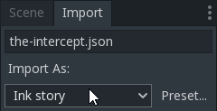

# godot-ink

An [ink](https://github.com/inkle/ink) integration for [Godot Engine](https://github.com/godotengine/godot).  

The following platforms have been tested with Godot 3.2.2:  
 * Windows 🗸
 * Linux 🗸
 * WebAssembly 🗸
 * iOS 🗸

I'm pretty sure this will also run fine on MacOS and Android but haven't witnessed it yet. If you end up testing an unlisted platform, please create an issue to tell me whether everything work or not.

Examples can be found in my [godot-ink-example](https://github.com/paulloz/godot-ink-example) repository.

## Installation

* Drop the `paulloz.ink/` folder in your project's `addons/` folder.
* Grab (or compile) `ink-engine-runtime.dll` from the [official ink repository](https://github.com/inkle/ink) and drop it at the root of your Godot project.
* Add the following to you `.csproj` file:
```xml
<ItemGroup>
    <Reference Include="Ink">
        <HintPath>$(ProjectDir)/ink-engine-runtime.dll</HintPath>
        <Private>False</Private>
    </Reference>
</ItemGroup>
```
* Build your project.
* Go to *Project -> Project Settings... -> Plugins* and tick the *Enable* checkbox.

## How to use

When the plugin is properly loaded, you should be able to use the new ink panel to inspect your story.


If you want to directly compile your `.ink` files, you'll also need to download the [ink compiler](https://github.com/inkle/ink/releases) on your computer and copy/paste the path to `inklecate.exe` into your project settings (*Project -> Project Settings... -> Ink -> Inklecate Path*).

---

Everything is handled in an `InkStory` node.  
In **GDScript** for some properties, you'll need to use a `get_` prefix (e.g. `get_CanContinue()` to access `CanContinue`). Trust your autocompletion.

### Loading the story

First you should navigate to your `.json` or `.ink` file and import it as an `Ink story` in Godot. To do that, select the file in Godot, go to `Import`, select `Ink story` under `Import As:` and click `ReImport`.



To load your story, you can:

* Point the `InkFile` exported variable to your `.json`/`.ink` file and check the `AutoLoadStory` checkbox in the inspector.
* Point the `InkFile` exported variable to your `.json`/`.ink` file (in the inspector or via a script) and call `story.LoadStory()`.

### Running the story and making choices

Getting content from the story is done by calling the `.Continue()` method.
```csharp
InkStory story = GetNode<InkStory>("Story");

while (story.CanContinue) {
    GD.Print(story.Continue());
    // Alternatively, text can be accessed from story.CurrentText
}
```

Choices are made with the `.ChooseChoiceIndex(int)` method.
```csharp
if (story.HasChoices) {
    foreach (string choice in story.CurrentChoices) {
        GD.Print(choice);
    }
    ...
    story.ChooseChoiceIndex(index);
}
```

### Using signals

If you don't want to bother accessing `CurrentText` and `CurrentChoices`, signals are emitted when the story continues forward and when a new choice appears.

```C#
    ...
    story.Connect(nameof(InkStory.InkContinued), this, "OnStoryContinued");
    story.Connect(nameof(InkStory.InkChoices), this, "OnChoices");
}

public void OnStoryContinued(string text, string[] tags)
{
}

public void OnStoryChoices(string[] choices)
{
}
```

The above signals are also available through the node inspector.

### Save / Load

You get and set the json state by calling `.GetState()` and `.SetState(string)`.

```csharp
string state = story.GetState();
...
story.SetState(state);
```

Alternatively you can save and load directly from disk (either by passing a path or a file as argument) with `.LoadStateFromDisk` and `.SaveStateOnDisk`.  
When using a path, the default behaviour is to use the `user://` folder. You can bypass this by passing a full path to the functions (e.g. `res://my_dope_save_file.json`).

```csharp
story.SaveStateOnDisk("save.json");
story.LoadStateFromDisk("save.json");
```

If you need to, those functions can also take a `File` in parameter.
```csharp
File file = new File();
file.Open("user://save.json", File.ModeFlags.Write);
story.SaveStateOnDisk(file);
file.Close();


file.open("user://save.json", File.ModeFlags.Read);
story.LoadStateFromDisk(file);
file.Close();
```

### Tags

Tags, global tags and knot tags are accessible respectively through `.CurrentTags`, `.GlobalTags` and `.TagsForContentAtPath(string)`.

```csharp
GD.Print(story.CurrentTags);
GD.Print(story.GlobalTags);
GD.Print(story.TagsForContentAtPath("mycoolknot"));
```

As shown above, current tags are also passed along the current text in the `InkContinued` event.

### Jumping to a Knot/Stitch

You can [jump to a particular knot or stitch](https://github.com/inkle/ink/blob/master/Documentation/RunningYourInk.md#jumping-to-a-particular-scene) with `.ChoosePathString(string)`. This method will return `false` if the jump failed.

```csharp
if story.ChoosePathString("mycoolknot.myradstitch") {
    story.Continue();
}
```

### Using Ink variables

Ink variables (except InkLists for now) can be get and set.

```csharp
story.GetVariable("foo");
story.SetVariable("foo", "bar");
```

They can also be observed with signals.

```csharp
    ...
    story.connect(story.ObserveVariable("foo"), this, "FooObserver")
}

private void FooObserver(string name, string value)
{
    GD.Print($"{name} = {value}");
}
```

If you're working with GDScript, you might want to enable **Marshall state variables** in your project's settings to avoid getting error when trying to access ink lists.

#### Read/Visit count

You can know how many times a knot/stitch has been visited with `.VisitCountPathString(string)`.

```csharp
GD.Print(story.VisitCountPathString("mycoolknot.myradstitch"));
```

## License

**godot-ink** is released under MIT license (see the [LICENSE](/LICENSE) file for more information).
